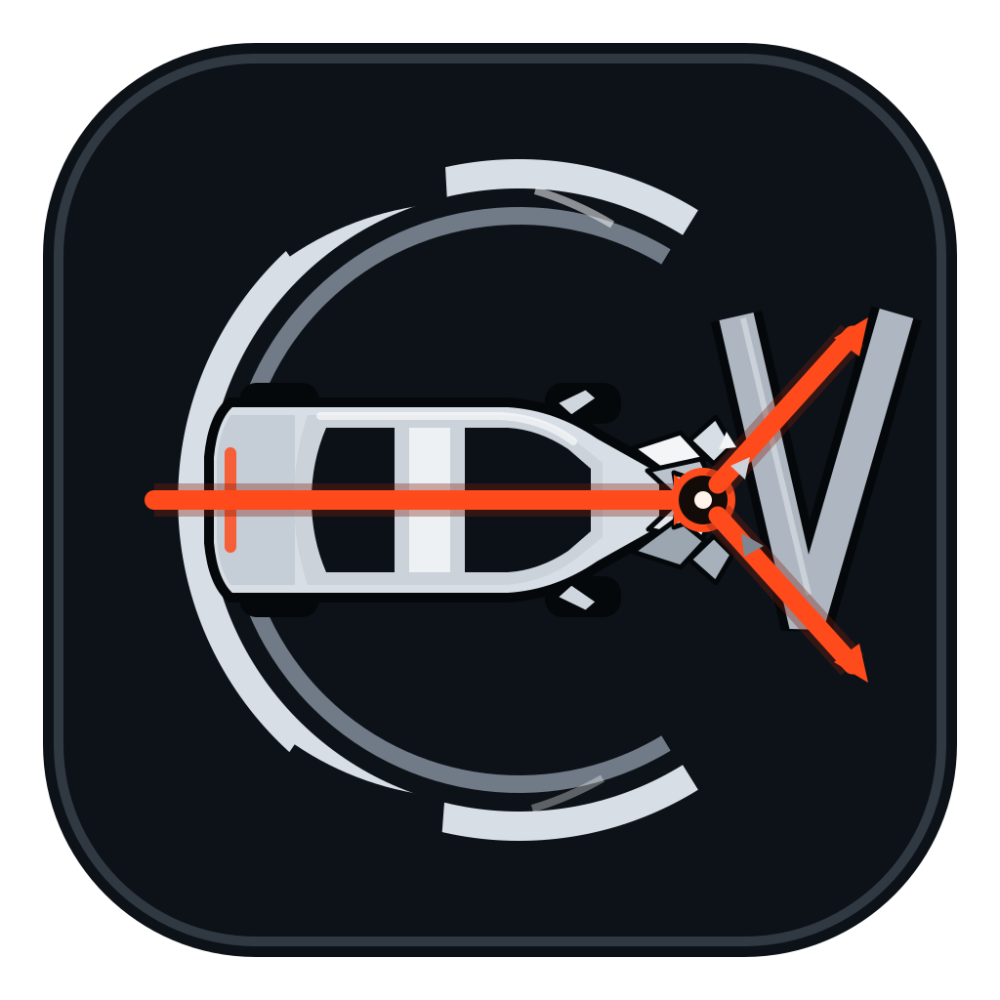

<p align="center">
  
</p>

<h1 align="center">CrashVector</h1>

<p align="center">
  <strong>Build a crash. Change the speed. Inspect the outcome.</strong>
</p>

<p align="center">
  Educational 3D collision simulation with generic deformable vehicles, replay, analysis and cinematic export.
</p>

<p align="center">
  
  <a href="https://github.com/ArrowSK/crashvector/actions/workflows/ci.yml"></a>
</p>

<p align="center">
  <a href="https://github.com/ArrowSK/crashvector/releases/download/v0.8.0-beta.1/CrashVector-0.8.0-beta.1-macOS-universal.dmg"></a>
  <a href="https://github.com/ArrowSK/crashvector/releases/download/v0.8.0-beta.1/CrashVector-0.8.0-beta.1-Windows-x64-Setup.exe"></a>
</p>

<p align="center">
  <a href="https://github.com/ArrowSK/crashvector/releases/tag/v0.8.0-beta.1">Release notes & checksums</a>
  ·
  <a href="docs/DISTRIBUTION.md">Installation & updates</a>
</p>

<p align="center">
  
  
  
  
</p>

CrashVector is an open-source desktop crash-simulation sandbox for people who want to **see what speed, mass and impact configuration change** without turning the exercise into specialist engineering software.

The current M12–M18 production architecture separates whole-object world motion, permanent structural deformation and presentation. Godot `RigidBody3D` owns supported vehicle/target world motion; CrashVector's passenger-car structural graph remains local deformation relative to the rigid chassis. M13 extends severe passenger-car failure beyond the nose, M14 adds rigid vulnerable-target trajectories and yielding pole/tree targets, M15 adds articulated pedestrian and bicycle dynamics, M16 reorganises the desktop workflow and adds class-specific generic visual profiles, M17 restores Comparison on the production rigid-body scene while adding reciprocal impact direction, passenger-car rear crush, rigid-lorry/motorcycle production routing and a long proving road, and M18 adds bounded passenger-car broadside deformation.

> **Current state:** `main` and the current packaged beta are complete through **M18**. Supported production scenarios include passenger-car impacts with rigid wall, concrete barrier, yielding generic pole/tree targets, another passenger car including broadside passenger-car layouts, the heavy articulated truck, rigid lorry, riderless motorcycle, articulated pedestrian contact/trajectory targets and riderless bicycles. Visual Compare and Comparison Lab run each variant through the current production scene rather than the historical reduced-order world solver.

> **Packaged release:** **`0.8.0-beta.1`** is the current public desktop beta, packaging the completed M17/M18 production stack for macOS Universal 2 and Windows x64.

> **Important boundary:** M18 broadside deformation is currently limited to passenger-car pairs. Heavy-truck, rigid-lorry, motorcycle and bicycle broadside cases remain outside the implemented lateral model. Rigid-lorry and motorcycle world motion is production `RigidBody3D` in M17, but their structural graphs remain rigid presentation/reference structures rather than detailed crush models.

> **Scope:** CrashVector is an educational physics visualisation tool. It is **not** certified accident reconstruction, homologation, manufacturer crash-performance prediction, biomechanics, medical/injury prediction or a safety-rating system. Pedestrian and bicycle results are contact/trajectory visualisations only; the bicycle target is riderless.

## Download and install

No Git, Godot, Python, Terminal or PowerShell is required for the packaged desktop beta.

| Platform | Download | Install |
| --- | --- | --- |
| macOS — Apple Silicon + Intel | **[Download macOS Universal 2 DMG](https://github.com/ArrowSK/crashvector/releases/download/v0.8.0-beta.1/CrashVector-0.8.0-beta.1-macOS-universal.dmg)** | Open the DMG, then drag **CrashVector.app** onto the **Applications** shortcut. Launch it from Applications. |
| Windows 10/11 x64 | **[Download Windows x64 Setup](https://github.com/ArrowSK/crashvector/releases/download/v0.8.0-beta.1/CrashVector-0.8.0-beta.1-Windows-x64-Setup.exe)** | Run Setup and follow the graphical installer. CrashVector installs under Program Files and appears in the Start menu and Installed apps. |

The matching SHA-256 checksum files and `update-manifest.json` are on the **[0.8.0-beta.1 release page](https://github.com/ArrowSK/crashvector/releases/tag/v0.8.0-beta.1)**.

This beta is ad-hoc signed on macOS and unsigned on Windows when paid signing credentials are not configured, so Gatekeeper or SmartScreen may warn about an unknown developer/publisher. Use only the files attached to the official `ArrowSK/crashvector` release.

To uninstall on macOS, quit CrashVector and move it from Applications to Trash. On Windows, use **Settings → Apps → Installed apps → CrashVector → Uninstall**.

CrashVector includes **Updates → Check for updates**. It can optionally check once per day; an update is downloaded and SHA-256 verified first, and installation is explicitly handed to the normal operating-system installer.

See **[Desktop distribution and updates](docs/DISTRIBUTION.md)** for detailed installation, removal, update, checksum and signing information.

## Normal M16 workflow

The default path is deliberately short:

```text
choose passenger-car class
          ↓
choose impact target
          ↓
set impact speed
          ↓
      Run simulation
          ↓
 replay · analysis · video
```

The desktop is organised around four jobs:

- **Scenario builder** — choose the primary passenger-car class, target and impact speed;
- **3D viewport** — inspect the crash and control the camera/overlays;
- **Properties** — edit the selected object, with solver/contact settings behind **Advanced setup**;
- **Playback dock** — replay, timeline, analysis and video export.

Defaults exist for normal scenarios, so mass and solver parameters are not mandatory setup work.

## Current production scope

| Area | What you get |
| --- | --- |
| Scenario editor | Task-focused M16/M16.1 desktop workflow with contextual Properties and Advanced setup |
| Passenger cars | Generic A / B / C / D / J / M classes with representative default masses and a refined 44-node local structural model |
| Vehicle presentation | Class-specific generated city-car, hatchback, compact, midsize, SUV and MPV visual archetypes driven by the deforming structural model |
| Whole-vehicle dynamics | Godot `RigidBody3D`, gravity, CCD and raycast suspension for the supported production path |
| Progressive structural failure | Front crush followed, when demand is sufficient, by firewall/cowl intrusion, floor/rocker and A-pillar/roof deformation, passenger-cell shortening and rear-body buckling |
| Reciprocal longitudinal impacts | Supported dynamic actors may strike from ahead or behind; passenger cars have bounded direct rear deformation and the heavy articulated truck has bounded front/rear collapse |
| Passenger-car side impacts | Passenger-car pairs support arbitrary heading deltas including perpendicular T-bone layouts, with bounded lateral protected-cell deformation and physical collision-face retreat |
| Heavy articulated truck | Rigid-body world motion, six suspension contacts, physical rear underride face and bounded local front/rear collapse; no fifth-wheel articulation model |
| Vulnerable road users | Articulated pedestrian targets and riderless bicycles with independent rigid-body parts; no injury or biomechanics prediction |
| Static / narrow targets | Wall and concrete barrier remain rigid; generic pole and tree targets can yield and move permanently at severe collision demand |
| Car vs car | Rear-end, near head-on and broadside passenger-car layouts using rigid-body world motion |
| Replay & analysis | 120 Hz recorded replay, timeline scrubbing, rigid-body velocity/momentum plus structural diagnostics and lateral-intrusion state where present |
| Comparison | Visual Compare and Comparison Lab execute each variant through the current production scene in an isolated `SubViewport` / `World3D` and replay the resulting production recordings |
| Other dynamic targets | Rigid lorry and riderless motorcycle use production Godot rigid-body world motion; their own detailed crush models are not implemented |
| Video export | 1080p / 1440p / 4K offline replay rendering at 30/60 fps with external FFmpeg H.264 encoding |
| Calibration | Historical M8 evidence labels/reference check retained separately from current M12–M18 production-world validation |
| Desktop distribution | Current `0.8.0-beta.1` macOS Universal 2 DMG and Windows x64 Setup installer with checksums and update manifest |

## Passenger-car classes

CrashVector uses **generic classes rather than production models**. There are no manufacturer badges, proprietary CAD files or claims that a class reproduces a particular real car.

| Class | Representative type | Default mass |
| --- | --- | ---: |
| A | City car | 950 kg |
| B | Small hatchback | 1,150 kg |
| C | Compact car | 1,375 kg |
| D | Midsize car | 1,575 kg |
| J | SUV / crossover | 1,850 kg |
| M | MPV / minivan | 2,050 kg |

The default mass is only a starting point. You can override it directly in the scenario.

M16 introduced the class-specific **presentation** profiles, and M16.1 strengthens their silhouettes further so the D-segment, SUV and MPV no longer read like lightly rescaled versions of the B-segment hatchback. The underlying physics remains the generic class-based CrashVector model.

## M12 — rigid-body correction

M12 moved supported whole-vehicle world motion away from the historical deformable point-mass graph and into Godot `RigidBody3D`. Passenger cars use real gravity, CCD and road suspension while the 44-node structural graph remains local deformation relative to the rigid chassis.

The passenger-car rigid collision volume ends around the protected cell/subframe. A forward probe measures available crush travel and drives the phenomenological nose-resistance path. The established 50 km/h wall and 90 km/h passenger-car-versus-truck engine regressions remain active historical preservation gates.

See [M12 hybrid physics](docs/M12_HYBRID_PHYSICS.md).

## M13 — progressive whole-body failure

M13 lets severe residual collision demand propagate beyond the finite front crush zone into firewall/cowl intrusion, floor/rocker and A-pillar/roof deformation, passenger-cell shortening and rear-body buckling. The stable M12 rigid-body world-motion path remains authoritative.

The generic B-class regression continues to distinguish moderate and extreme wall loading:

- **50 km/h:** about 105.0 kJ demand, 0.536 m front crush and effectively zero firewall/cabin/rear collapse;
- **200 km/h:** about 1,739.2 kJ demand, 0.945 m front-zone crush, 0.300 m firewall intrusion, 0.820 m passenger-cell collapse, 0.231 m rear-body buckle and 1.948 m combined longitudinal collapse.

These are generic project regression measurements, not predictions for a production car.

See [M13 progressive whole-body failure](docs/M13_PROGRESSIVE_FAILURE.md).

## M14 — vulnerable road users and yielding narrow obstacles

M14 moved pedestrian and riderless-bicycle targets onto a real Godot rigid-body world-motion path and allowed generic pole/tree targets to yield permanently at severe collision demand. Wall and concrete barrier remain rigid.

M14 also fixed the evidence-scope modal stacking issue without redesigning the calibration panel or changing its callbacks.

See [M14 road users and yielding obstacles](docs/M14_ROAD_USERS_OBSTACLES.md).

## M15 — articulated pedestrian and bicycle dynamics

M15 replaces the one-rigid-body vulnerable-target approximation with articulated production targets while keeping the existing production API and passenger-car architecture stable.

- Pedestrians use an 11-body articulated rigid chain with 10 bounded `Generic6DOFJoint3D` constraints.
- Riderless bicycles use a rigid frame plus two independently simulated wheel bodies joined at the hubs.
- Replay records/restores articulated part transforms and velocities.
- Dedicated regression rejects excessive target centre-of-mass energy, direct-joint folding and passenger-car launch/rebound instability.

At the final 60 km/h regression the pedestrian finishes at 2.51 m/s centre-of-mass speed with 13.97 m maximum travel and 105.2° maximum direct-joint motion; the riderless city bicycle finishes at 9.21 m/s with 19.22 m maximum travel and 34.85 rad/s maximum wheel motion. These are numerical stability/trajectory regressions, not biomechanical validation corridors.

See [M15 articulated road users](docs/M15_ARTICULATED_ROAD_USERS.md).

## M16 — UX and class-specific vehicle visuals

M16 reorganises the desktop around scenario building, the central 3D viewport, contextual Properties and a persistent playback dock. Solver/contact controls move behind **Advanced setup**, while file, update, calibration/evidence, replay, analysis and export functions remain available.

The new passenger-car skin is presentation-only. `VehicleVisualProfileCatalog` provides materially different generic city-car, hatchback, compact, midsize, SUV and MPV proportions. The visual layer reads the same deforming structural model every frame and does not change rigid collision geometry, mass, stiffness, structural beams, crush behaviour, contact probes or solver settings.

M16's production regression also verifies that selecting a pedestrian through the real UI still instantiates the finalized M15 articulated production target rather than falling back to the M14 proxy.

See [M16 UX and vehicle visuals](docs/M16_UX_AND_VEHICLE_VISUALS.md).

## M16.1 — packaged visual and UX correction

M16.1 is a presentation-only correction based on review of the packaged `0.7.0-beta.1` application. It keeps the M12–M15 production physics path intact while fixing stale automatic scenario names, misleading selected-workspace styling, duplicate helper text, the oversized completed-run selection oval and excessively wide camera framing.

The setup and aftermath cameras now frame the current vehicle/target bounds rather than enforcing the old 18 m minimum offset. D-segment, SUV and MPV archetypes receive stronger class-specific silhouettes while remaining generated from the same deforming structural anchors. A dedicated regression runs the D-segment midsize / concrete barrier / 200 km/h case through the real production controls and verifies completion, replay creation, final presentation synchronization and aftermath camera composition.

See [0.7.0-beta.2 release notes](docs/releases/0.7.0-beta.2.md).

## M17 — reciprocal impacts and production comparison

M17 removes the remaining direction and comparison assumptions from the production integration layer. Supported dynamic actors may approach from either direction; passenger cars gain bounded rear deformation; the heavy truck gains bounded front/rear collapse; rigid lorry and riderless motorcycle move through the production Godot rigid-body path; and the collision road is extended to approximately 4 km.

Visual Compare and Comparison Lab now execute each requested variant through the actual production scene in an isolated world and use the resulting production replay/analysis state. The historical reduced-order runner remains available only for legacy regression continuity.

See [M17 reciprocal impacts, production comparison and long proving road](docs/M17_RECIPROCAL_IMPACTS_COMPARISON.md).

## M18 — passenger-car side impacts

M18 adds bounded broadside deformation for passenger-car pairs without replacing the M12–M17 rigid-body architecture. Real Godot contact samples on a protected-cell side face drive a generic lateral intrusion envelope; the corresponding physical collision face retreats laterally and the existing deformable presentation graph follows the struck-side structural state.

The dedicated perpendicular regression uses a stationary C-segment passenger car and a B-segment passenger car approaching at 55 km/h and -90 degrees. It records approximately 0.058 m lateral intrusion on the struck car and 0.305 m front deformation on the striking car. These are CrashVector regression values, not manufacturer or regulatory side-impact data.

Broadside support in M18 is limited to passenger-car pairs. Heavy-vehicle, lorry, motorcycle and bicycle broadside modelling remains outside the implemented lateral envelope.

See [M18 passenger-car side impacts](docs/M18_SIDE_IMPACTS.md).

## Replay, analysis and cinematic export

CrashVector records supported production simulation at **120 Hz**. Replay stores rigid-body state plus local structural/articulated presentation state, so scrubbing and video export do not re-run the crash.

Playback supports 0.05× / 0.10× / 0.25× / 0.50× / 1× speeds, timeline scrubbing, structural diagnostics and velocity/momentum overlays where meaningful.

**Cinematic Video** renders from the recorded replay and supports:

- 1080p, 1440p and 4K;
- 30 or 60 fps;
- Auto Cinematic, Wide, Tracking, Impact Close-up and Aftermath Orbit cameras;
- impact-centred slow motion;
- title/result cards and educational overlays;
- optional retained source frames;
- machine-readable `.crashvector-video.json` metadata.

CrashVector calls an **external FFmpeg installation** for H.264 MP4 encoding. FFmpeg is not bundled with the repository. See [Video export](docs/VIDEO_EXPORT.md).

## Calibration and evidence labels

CrashVector deliberately separates **a convincing visual** from **a validated engineering claim**.

The historical M8 reduced-order reference uses the NHTSA NCAP full-frontal rigid-wall condition documented in **DOT HS 812 237 / laboratory test 7078**, with the documented **1,661 kg** test mass and **56.5 km/h** impact condition.

The application retains the labels **Reference-correlated**, **Near reference**, **Class-scaled** and **Extrapolated**.

The M8 calibration runner remains a historical regression/correlation path. It does **not** validate the M12–M18 rigid-body, staged-collapse, articulated-road-user, reciprocal-impact, comparison or side-impact production path, and current project regression numbers are not manufacturer or regulatory corridors.

See [Calibration and validation scope](docs/CALIBRATION.md) and [Physics notes](docs/PHYSICS.md).

## Known modelling boundaries

CrashVector intentionally rejects or limits scenarios instead of making a visually plausible but unsupported claim.

- Current production rigid-body coverage includes wall, barrier, yielding generic pole/tree, passenger-car, heavy articulated truck, rigid lorry, riderless motorcycle, articulated pedestrian and riderless bicycle targets.
- Passenger-car broadside contact is implemented in M18; broadside heavy-truck, rigid-lorry, motorcycle and bicycle contact is not.
- Rigid lorry and riderless motorcycle use production world motion, but M17 does not provide their own detailed crush structures.
- Pedestrian and bicycle output is contact/trajectory visualisation only; no biomechanical or injury prediction is performed, and the bicycle target is riderless.
- Visual Compare and Comparison Lab use the production scene in M17; historical reduced-order comparison code remains only for regression continuity.
- Generic vehicle classes and M16/M16.1 visual profiles are not production-car crash models.
- M13 staged collapse, M14 narrow-target yielding, M17 reciprocal deformation and M18 lateral deformation are phenomenological reduced-order models, not finite-element structural analysis or manufacturer body-in-white/target data.
- M15 joint limits are numerical stability envelopes, not human biomechanical ranges.
- Target geometry remains simplified.
- M8 calibration does not validate the M12–M18 production architecture.
- CI validates deterministic logic, editor runtime and engine-physics regression paths, but does not perform a real 4K GPU render or invoke the machine's FFmpeg binary.

## Run from source

Requirements:

- **Godot 4.4.1 or newer**
- Git

```bash
git clone https://github.com/ArrowSK/crashvector.git
cd crashvector
godot --editor --path .
```

Or open `project.godot` directly in Godot and run the project.

## Documentation

| Guide | What it is for |
| --- | --- |
| [Roadmap](docs/ROADMAP.md) | Implementation history and future physics work |
| [Architecture](docs/ARCHITECTURE.md) | Structural, simulation, replay, distribution and presentation layers |
| [0.8.0-beta.1 release notes](docs/releases/0.8.0-beta.1.md) | Current packaged M17/M18 beta and release boundaries |
| [M18 side impacts](docs/M18_SIDE_IMPACTS.md) | Passenger-car broadside contact, bounded lateral deformation and evidence limits |
| [M17 reciprocal impacts and comparison](docs/M17_RECIPROCAL_IMPACTS_COMPARISON.md) | Production comparison, reciprocal impact direction, lorry/motorcycle routing and long proving road |
| [M16 UX and vehicle visuals](docs/M16_UX_AND_VEHICLE_VISUALS.md) | Task-focused desktop shell and class-specific presentation layer |
| [M15 articulated road users](docs/M15_ARTICULATED_ROAD_USERS.md) | Articulated pedestrian/bicycle topology, stability decisions and validation limits |
| [M14 road users and yielding obstacles](docs/M14_ROAD_USERS_OBSTACLES.md) | Rigid vulnerable-target trajectories, generic pole/tree yielding and M14 gates |
| [M13 progressive failure](docs/M13_PROGRESSIVE_FAILURE.md) | Whole-body staged failure, collision-demand model and limitations |
| [M12 hybrid physics](docs/M12_HYBRID_PHYSICS.md) | Rigid-body world-motion architecture, road/contact coupling and coverage boundaries |
| [M11 crush dynamics](docs/M11_CRUSH_DYNAMICS.md) | Refined 44-node structure and historical reduced-order M11 dynamics |
| [Physics notes](docs/PHYSICS.md) | Contact, energy accounting, structural assumptions and modelling boundaries |
| [Calibration](docs/CALIBRATION.md) | Reference source, evidence labels and historical regression corridors |
| [Scenario format](docs/SCENARIO_FORMAT.md) | Human-readable `.crashvector.json` save/load format |
| [Video export](docs/VIDEO_EXPORT.md) | Offline rendering, camera modes, FFmpeg boundary and metadata |
| [Desktop distribution and updates](docs/DISTRIBUTION.md) | Installation, updater, packaging, signing and release architecture |

## Development status

**M18 is the current source and packaged milestone.** M17 restored production Comparison, reciprocal dynamic-impact direction and rigid-lorry/motorcycle production routing; M18 adds passenger-car broadside physics. The dedicated M17 and M18 gates passed on their final PR heads and again on the merged M18 source state together with canonical Core CI and native packaging checks.

The current public installers are **`v0.8.0-beta.1`**, built from the M17/M18 source line with verified macOS Universal 2 and Windows x64 packages, checksum sidecars and `update-manifest.json`.

The next physics work should focus on richer target-specific contact/deformation models and additional independent public/licensed references before extending validation claims.

## Licence

CrashVector source code is licensed under the **Mozilla Public License 2.0 (MPL-2.0)**. See [LICENSE](LICENSE).

Third-party components and externally installed tools may carry their own licences; see [THIRD_PARTY_NOTICES.md](THIRD_PARTY_NOTICES.md).